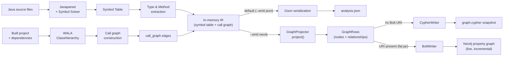

import { Aside, FileTree } from "@astrojs/starlight/components";

codeanalyzer-java combines two complementary static-analysis technologies behind a single CLI. The same intermediate representation (IR) — a symbol table plus an optional call graph — is emitted either as the canonical `analysis.json` or as a Neo4j property graph. This page describes how the pieces fit together.

## The analysis pipeline

There are two analysis tracks that converge into one IR, which then fans out to one of two emitters:

1. **Symbol extraction (Javaparser).** Always runs. Parses each `.java` file into an AST, resolves types against downloaded library dependencies (or, for single-source mode, against the JDK only), and walks the AST to collect types, callables, fields, comments, and imports.

2. **Call-graph construction (WALA).** Runs only at [analysis level 2](/codeanalyzer-java/guides/analysis-levels/). Builds a class hierarchy from the compiled project and computes an interprocedural call graph, emitted as caller→callee edges.

By default both tracks are serialized by Gson into a single `analysis.json` whose field names use `lower_case_with_underscores`, with nulls preserved (`serializeNulls`) so consumers see a stable shape. With `--emit neo4j`, the *same* IR is instead projected into a Neo4j property graph — a **lossless** projection where every IR entity becomes a first-class node or relationship.

### Stage by stage

The CLI orchestrator (`CodeAnalyzer`) runs roughly this sequence:

1. **Resolve inputs** — determine project root, output path, analysis level, emit target, and whether to build.
2. **Download dependencies** — `BuildProject` invokes Maven/Gradle to fetch library JARs into a temporary `_library_dependencies` directory, used by the symbol solver for type resolution. See [Build integration](/codeanalyzer-java/guides/build-integration/).
3. **Extract symbol table** — `SymbolTable` parses sources. There are three entry points: `extractAll` (whole project), `extract` (specific [target files](/codeanalyzer-java/guides/incremental-analysis/)), and `extractSingle` (a source string).
4. **Construct call graph** (level 2 only) — `SystemDependencyGraph` runs WALA over the built project and produces a list of edges.
5. **Clean up** — the temporary dependency directory is removed (unless `--no-clean-dependencies` is set).
6. **Emit** — selected by `--emit` (default `json`):
   - **`json`** — Gson serializes `{ symbol_table, call_graph?, version }` to `analysis.json`, or to stdout if no output directory was given.
   - **`neo4j`** — projects the IR to a Neo4j property graph instead of writing `analysis.json` (see below). This is an *alternative*, not an addition: when `emit == neo4j` the analyzer returns without writing `analysis.json`.
   - **`schema`** — prints the machine-readable schema contract (`schema.neo4j.json`) and returns before any project analysis. Useful for publishing the graph's versioned shape to consumers.

<Aside type="note">
Type resolution quality depends on dependencies being available. That's why level-2 analysis builds the project by default — WALA needs compiled classes, and the symbol solver benefits from the resolved classpath.
</Aside>

### The Neo4j emit path

When `--emit neo4j` is given, the orchestrator hands the in-memory IR to `GraphProjector.project()`, which turns it into `GraphRows` — a flat, batched set of node and relationship rows that mirrors the [graph schema](/codeanalyzer-java/schema/). At level 2 the projection also includes `J_CALLS` edges from the WALA call graph; at level 1 it emits the lossless symbol-table subgraph with no `J_CALLS`. Every emitted graph is anchored at a single `:JApplication` node (keyed on `--app-name`) and stamped with `schema_version` `1.0.0`.

`GraphRows` is then handed to one of two writers, chosen purely by whether a Bolt URI resolved (the `--neo4j-uri` flag or the `NEO4J_URI` environment variable):

- **No URI → `CypherWriter`.** Renders a self-contained, re-runnable `graph.cypher` snapshot: the constraints and indexes, a *scoped wipe* of this application's prior subgraph, then batched `UNWIND … MERGE` statements (batch size 500) for nodes and edges. The snapshot is **not** incremental — it expresses the full truth of one analysis run. Load it with `cypher-shell < graph.cypher`.

- **URI present → `BoltWriter`.** Pushes incrementally over the official Neo4j Java driver: it ensures constraints/indexes, diffs each compilation unit's `content_hash` (a SHA-256 over the unit) against the live database, and replaces *only* changed units' subgraphs via idempotent `MERGE` upserts (batch size 1000). Shared `:JPackage`/`:JAnnotation` nodes are `MERGE`-only so they coexist across applications. On a full run it prunes units whose source file has vanished; on a [targeted run](/codeanalyzer-java/guides/incremental-analysis/) (`-t`) that orphan pruning is skipped.

This is the producer side of a producer/consumer split: the analyzer runs out-of-band (a CI job or Kubernetes `CronJob`) and pushes app-scoped subgraphs into a shared cluster, while lightweight read-only consumers — agents, dashboards, and the [CLDK Python SDK](/codeanalyzer-java/integration/python-sdk/) — fan out reads from it. See the [Neo4j graph guide](/codeanalyzer-java/guides/neo4j-output/) for the full producer/consumer story.

<Aside type="caution">
The Bolt push is wired through a reflective seam (`Neo4jEmitter.loadBoltSink` → `BoltSink`), so the Neo4j driver and Netty are **not** bundled into the GraalVM native image. In the prebuilt native binary, `--neo4j-uri` therefore degrades gracefully to writing a `graph.cypher` snapshot with a warning. The live, incremental Bolt push happens from the fat jar (`java -jar`).
</Aside>

## Package structure

The analyzer lives under the `com.ibm.cldk` package:

<FileTree>
- com.ibm.cldk
  - CodeAnalyzer.java        CLI entry point; orchestrates the pipeline
  - SymbolTable.java         Javaparser-based symbol extraction
  - SystemDependencyGraph.java   WALA-based call-graph construction
  - entities/                Output data model (serialized to JSON)
    - JavaCompilationUnit.java   one .java file: types + imports + comments
    - Type.java              class / interface / enum / record
    - Callable.java          method or constructor
    - Field.java             member field
    - Comment.java           Javadoc / inline comment
    - Import.java            import declaration (path, static, wildcard)
    - CallableVertex.java    call-graph node
    - CallEdge.java          call-graph edge
    - CallSite.java          an individual call within a method body
    - CRUDOperation.java     a detected DB operation
    - CRUDQuery.java         a detected query definition
    - ...
  - neo4j/                   Neo4j property-graph projection (`--emit neo4j`)
    - Neo4jEmitter.java      emit entry point; picks snapshot vs. live Bolt
    - GraphProjector.java    IR → graph nodes + relationships
    - RowBuilder.java        builds per-label/relationship row sets
    - GraphRows.java         the batched node + relationship payload
    - CypherWriter.java      renders the re-runnable graph.cypher snapshot
    - BoltWriter.java        incremental, content_hash-diffed live push
    - BoltSink.java          reflective seam over the Neo4j driver
    - BoltConfig.java        driver-free Bolt connection config
    - SchemaCatalog.java     builds schema.neo4j.json (`--emit schema`)
    - Schema.java            constraints + indexes DDL (labels, fulltext)
  - javaee/                  framework-specific finders
    - EntrypointsFinderFactory.java   selects entry-point detectors
    - CRUDFinderFactory.java          selects CRUD detectors
    - spring/                Spring detectors
    - struts/                Struts detectors
    - jax/                   JAX-RS detectors
    - jakarta/               Servlet / JPA detectors
    - camel/                 Camel (stub)
  - utils/
    - BuildProject.java      Maven/Gradle build + dependency download
    - Log.java               verbosity-aware logging
</FileTree>

## Core dependencies

| Library | Version | Role |
|---------|---------|------|
| **WALA** | 1.6.7 | Class hierarchy, interprocedural call graph (`shrike`, `util`, `core`, `cast`, `cast.java`, `cast.java.ecj`) |
| **Javaparser** | — | Source parsing and symbol/type resolution |
| **Eclipse JDT** | 3.21.0 | Backing compiler/AST infrastructure used during analysis |
| **Picocli** | 4.1.0 | Command-line interface |
| **Gson** | 2.10.1 | JSON serialization of the output schema |
| **Neo4j Java driver** | 4.4.12 | Live, incremental Bolt push for `--emit neo4j --neo4j-uri …` |
| **JGraphT** | 1.5.2 | Graph data structures |
| **Guava** | 33.0.0 | General utilities |
| **Log4j** | 2.18.0 | Logging |

The whole set is shaded into one fat JAR by `./gradlew fatJar`, so a single `java -jar` invocation has everything it needs — including the Neo4j driver for the live Bolt push.

<Aside type="note">
The Neo4j driver is loaded reflectively rather than referenced directly, so the GraalVM native image (`./gradlew nativeCompile`) prunes the driver and Netty entirely. That keeps the native binary small and Netty-metadata-free at the cost of the live Bolt push, which is why `--neo4j-uri` falls back to a `graph.cypher` snapshot there.
</Aside>

## Where to go next

- [Analysis levels](/codeanalyzer-java/guides/analysis-levels/) — what level 1 vs. level 2 actually compute.
- [Build integration](/codeanalyzer-java/guides/build-integration/) — how dependency download and project builds work.
- [Neo4j property graph](/codeanalyzer-java/guides/neo4j-output/) — the producer/consumer architecture, snapshot vs. live Bolt, and multi-tenant graph design.
- [Output schema](/codeanalyzer-java/schema/) — the JSON and the Neo4j graph these stages produce.
