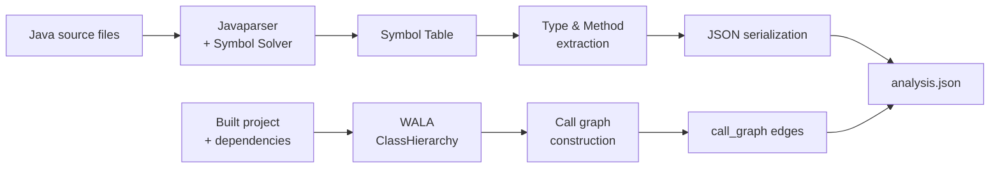

import { Aside, FileTree } from "@astrojs/starlight/components";

codeanalyzer-java combines two complementary static-analysis technologies behind a single CLI and a single JSON output. This page describes how the pieces fit together.

## The analysis pipeline

There are two tracks that converge into one document:

1. **Symbol extraction (Javaparser).** Always runs. Parses each `.java` file into an AST, resolves types against downloaded library dependencies (or, for single-source mode, against the JDK only), and walks the AST to collect types, callables, fields, comments, and imports.

2. **Call-graph construction (WALA).** Runs only at [analysis level 2](/codeanalyzer-java/guides/analysis-levels/). Builds a class hierarchy from the compiled project and computes an interprocedural call graph, emitted as caller→callee edges.

Both tracks are serialized by Gson into a single `analysis.json` whose field names use `lower_case_with_underscores`, with nulls preserved (`serializeNulls`) so consumers see a stable shape.

### Stage by stage

The CLI orchestrator (`CodeAnalyzer`) runs roughly this sequence:

1. **Resolve inputs** — determine project root, output path, analysis level, and whether to build.
2. **Download dependencies** — `BuildProject` invokes Maven/Gradle to fetch library JARs into a temporary `_library_dependencies` directory, used by the symbol solver for type resolution. See [Build integration](/codeanalyzer-java/guides/build-integration/).
3. **Extract symbol table** — `SymbolTable` parses sources. There are three entry points: `extractAll` (whole project), `extract` (specific [target files](/codeanalyzer-java/guides/incremental-analysis/)), and `extractSingle` (a source string).
4. **Construct call graph** (level 2 only) — `SystemDependencyGraph` runs WALA over the built project and produces a list of edges.
5. **Clean up** — the temporary dependency directory is removed (unless `--no-clean-dependencies` is set).
6. **Emit** — Gson serializes `{ symbol_table, call_graph?, version }` to `analysis.json`, or to stdout if no output directory was given.

<Aside type="note">
Type resolution quality depends on dependencies being available. That's why level-2 analysis builds the project by default — WALA needs compiled classes, and the symbol solver benefits from the resolved classpath.
</Aside>

## Package structure

The analyzer lives under the `com.ibm.cldk` package:

<FileTree>
- com.ibm.cldk
  - CodeAnalyzer.java        CLI entry point; orchestrates the pipeline
  - SymbolTable.java         Javaparser-based symbol extraction
  - SystemDependencyGraph.java   WALA-based call-graph construction
  - entities/                Output data model (serialized to JSON)
    - JavaCompilationUnit.java   one .java file: types + imports + comments
    - Type.java              class / interface / enum / record
    - Callable.java          method or constructor
    - Field.java             member field
    - Comment.java           Javadoc / inline comment
    - Import.java            import declaration (path, static, wildcard)
    - CallableVertex.java    call-graph node
    - CallEdge.java          call-graph edge
    - CallSite.java          an individual call within a method body
    - CRUDOperation.java     a detected DB operation
    - CRUDQuery.java         a detected query definition
    - ...
  - javaee/                  framework-specific finders
    - EntrypointsFinderFactory.java   selects entry-point detectors
    - CRUDFinderFactory.java          selects CRUD detectors
    - spring/                Spring detectors
    - struts/                Struts detectors
    - jax/                   JAX-RS detectors
    - jakarta/               Servlet / JPA detectors
    - camel/                 Camel (stub)
  - utils/
    - BuildProject.java      Maven/Gradle build + dependency download
    - Log.java               verbosity-aware logging
</FileTree>

## Core dependencies

| Library | Version | Role |
|---------|---------|------|
| **WALA** | 1.6.7 | Class hierarchy, interprocedural call graph (`shrike`, `util`, `core`, `cast`, `cast.java`, `cast.java.ecj`) |
| **Javaparser** | — | Source parsing and symbol/type resolution |
| **Eclipse JDT** | 3.21.0 | Backing compiler/AST infrastructure used during analysis |
| **Picocli** | 4.1.0 | Command-line interface |
| **Gson** | 2.10.1 | JSON serialization of the output schema |
| **JGraphT** | 1.5.2 | Graph data structures |
| **Guava** | 33.0.0 | General utilities |
| **Log4j** | 2.18.0 | Logging |

The whole set is shaded into one fat JAR by `./gradlew fatJar`, so a single `java -jar` invocation has everything it needs.

## Where to go next

- [Analysis levels](/codeanalyzer-java/guides/analysis-levels/) — what level 1 vs. level 2 actually compute.
- [Build integration](/codeanalyzer-java/guides/build-integration/) — how dependency download and project builds work.
- [Output schema](/codeanalyzer-java/schema/) — the JSON these stages produce.
