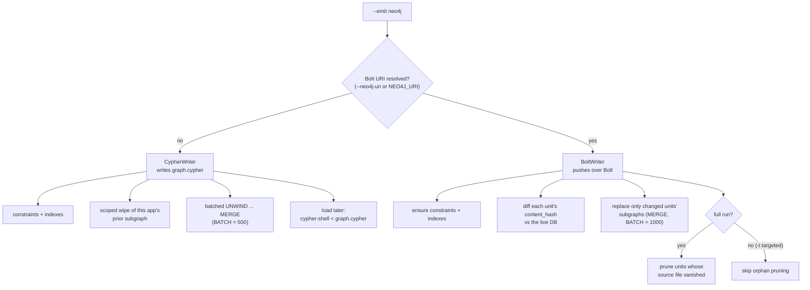

import { Aside, Steps, Tabs, TabItem, Card, CardGrid } from "@astrojs/starlight/components";
import Neo4jPropertyGraph from '../../../components/Neo4jPropertyGraph.astro';

By default codeanalyzer-java writes one `analysis.json` per project. That file is self-contained, but it doesn't compose: to ask a question across a portfolio you load every blob into memory and stitch them together yourself. `--emit neo4j` projects the same symbol table and call graph into a **Neo4j property graph** instead — a queryable, persistent system of record that many applications can share, and that downstream tools read with Cypher rather than by parsing giant JSON files.

<Neo4jPropertyGraph />

The projection is **lossless**: every entity the analyzer extracts — compilation units, types, callables, fields, parameters, call sites, variables, enum constants, record components, initialization blocks, CRUD operations and queries, comments, annotations, and packages — becomes a first-class node or relationship. All node labels are `J`-prefixed and all relationship types are `J_`-prefixed, so a Java graph can share one Neo4j database with the Python (`Py*` / `PY_*`) and TypeScript (`TS*` / `TS_*`) backends without colliding. For the full label and relationship inventory, see the [graph-schema reference](/codeanalyzer-java/schema/).

<Aside type="note" title="It's an alternative output, not an addition">
`--emit` selects *one* output target. With `--emit neo4j` the analyzer projects the IR and returns **without** writing `analysis.json`. The default (`--emit json`) is unchanged. There is also `--emit schema`, which prints the schema contract and runs no analysis at all (see [The schema contract](#the-schema-contract)).
</Aside>

## Two emit modes

`--emit neo4j` has two sub-modes, chosen purely by **whether a Bolt URI resolved** — from `--neo4j-uri` or the `NEO4J_URI` environment variable:



- **No URI → a `graph.cypher` snapshot.** A self-contained, re-runnable Cypher file expressing the *full* truth of this run. Good for review, version control, air-gapped loads, and CI artifacts.
- **URI present → a live, incremental Bolt push.** The analyzer connects to a running Neo4j and updates only what changed since the last run. This is the mode you deploy against a shared cluster.

<Aside type="caution" title="Native-image caveat">
The Neo4j driver is deliberately **not** bundled into the GraalVM native binary — it's loaded reflectively, so the native image can prune the driver and Netty. As a result, the prebuilt `codeanalyzer` native binary cannot open a Bolt connection: when you pass `--neo4j-uri` it **degrades gracefully to writing `graph.cypher`** and logs a warning. The live push happens from the fat JAR (`java -jar codeanalyzer-*.jar`). Use the JAR wherever you push over Bolt.
</Aside>

## The `graph.cypher` snapshot

With no Bolt URI, codeanalyzer renders a `CypherWriter` snapshot to `<output>/graph.cypher` (defaulting to the current working directory if `-o` is omitted):

```bash
java -jar codeanalyzer-2.3.7.jar \
  -i /path/to/project -a 2 \
  --emit neo4j \
  --app-name daytrader8 \
  -o ./out
# -> ./out/graph.cypher
```

The file is a single, ordered, re-runnable script that:

<Steps>

1. Declares the **constraints and indexes** (uniqueness constraints plus a fulltext index for code search — see [The schema contract](#the-schema-contract)).
2. Runs a **scoped wipe** of *this application's* prior subgraph — `MATCH (a:JApplication {name: 'daytrader8'})` then `DETACH DELETE` its units and their descendants. Shared `:JPackage` and `:JAnnotation` nodes are left intact so other applications keep theirs.
3. Loads nodes and edges with **batched `UNWIND ... MERGE`** (`BATCH = 500`).

</Steps>

Because the snapshot expresses full truth and wipes-then-reloads, **it is not incremental** — re-running it replaces this app's subgraph wholesale. Load it whenever you're ready:

```bash
cypher-shell -a bolt://localhost:7687 -u neo4j < ./out/graph.cypher
```

The scoped wipe means the snapshot is safe to load into a database that already hosts *other* applications: only the matching `:JApplication` anchor and its descendants are touched.

## The live Bolt push

When a Bolt URI resolves, the `BoltWriter` connects over the official `neo4j-java-driver` and updates the graph in place. Prefer the `NEO4J_PASSWORD` environment variable over `--neo4j-password` so the secret never lands in shell history or process listings:

```bash
export NEO4J_URI=bolt://localhost:7687
export NEO4J_USERNAME=neo4j
export NEO4J_PASSWORD=secret        # keep credentials out of argv

java -jar codeanalyzer-2.3.7.jar \
  -i /path/to/project -a 2 \
  --emit neo4j \
  --app-name daytrader8
```

Everything resolves with a consistent precedence — **flag > environment variable > default**:

| Setting | Flag | Environment | Default |
|---------|------|-------------|---------|
| Bolt URI | `--neo4j-uri` | `NEO4J_URI` | *(none → snapshot mode)* |
| Username | `--neo4j-user` | `NEO4J_USERNAME` | `neo4j` |
| Password | `--neo4j-password` | `NEO4J_PASSWORD` | `neo4j` |
| Database | `--neo4j-database` | `NEO4J_DATABASE` | *(server default)* |

The database is only pinned (`SessionConfig.forDatabase`) when you set it non-null; otherwise the driver uses the server's default database.

### What "incremental" means here

The push is genuinely incremental, not a wipe-and-reload. For each compilation unit, `BoltWriter`:

<Steps>

1. **Diffs the `content_hash`.** Each unit carries a SHA-256 over its source. The writer reads the live DB's current state and compares — units whose hash is unchanged are skipped entirely.
2. **Replaces only changed units' subgraphs** via idempotent `MERGE` upserts (`BATCH = 1000`), so re-running the same analysis is a no-op against an up-to-date graph.
3. **Upserts shared nodes `MERGE`-only.** `:JPackage` and `:JAnnotation` are shared across applications; they are merged, never deleted, so concurrent app writers don't clobber each other.
4. **Prunes orphans on a full run.** When you analyze the whole project (no `-t`), units whose source file has vanished are removed. On a **targeted** run (`-t` / `--target-files`), pruning is **skipped** — a targeted run only knows about the files you named, so it replaces just those subgraphs and leaves everything else alone.

</Steps>

This is what makes the graph cheap to keep current: a CI job that re-analyzes on every push touches only the units that actually changed.

<Aside type="tip" title="Targeted incremental updates">
Combine `--emit neo4j` over Bolt with `-t` to patch just the files a commit changed:

```bash
java -jar codeanalyzer-2.3.7.jar \
  -i /path/to/project \
  -t src/main/java/com/example/Service.java \
  --emit neo4j --app-name daytrader8
```

Note that `-t` forces [level 1](/codeanalyzer-java/guides/incremental-analysis/), so a targeted run refreshes the symbol-table subgraph but not `J_CALLS` edges. Run a full `-a 2` analysis to recompute the call graph.
</Aside>

## Scoping and multi-tenancy

`--app-name` is the tenancy key. It sets the `name` of the single `:JApplication` anchor node (a uniqueness constraint guarantees one per name), and **every** analyzed compilation unit hangs off it via `(:JApplication {name})-[:J_HAS_UNIT]->(:JCompilationUnit)`. Both emit modes scope all of their writes — the snapshot's wipe and the Bolt push's upserts and pruning — to that one anchor.

If you omit `--app-name`, it defaults to the base name of the `-i` input directory (or the literal `application` when there is no input). Because the wipe and the push are app-scoped, **many applications coexist in one database**, each rooted at its own anchor:

```cypher
// list every application living in this database
MATCH (a:JApplication)
RETURN a.name AS application, a.schema_version AS schema
ORDER BY application;
```

Cross-service questions become a graph traversal instead of a memory problem. A whole-portfolio query never loads anything it doesn't need:

```cypher
// which applications declare a type that implements javax.servlet.Filter?
MATCH (a:JApplication)-[:J_HAS_UNIT]->(:JCompilationUnit)
      -[:J_DECLARES_TYPE]->(t:JType)
WHERE 'javax.servlet.Filter' IN t.implements_list
RETURN DISTINCT a.name AS application, t.fqn AS filter
ORDER BY application;
```

### Schema version stamping

Every emitted graph stamps `schema_version` on its `:JApplication` node. The current schema version is **`1.0.0`**. Read it straight off the anchor to confirm what contract a given application was loaded under:

```cypher
MATCH (a:JApplication {name: 'daytrader8'})
RETURN a.schema_version;   // -> "1.0.0"
```

## The schema contract

`--emit schema` publishes the machine-readable schema contract — the catalog of every label, relationship, and property the projector is allowed to emit — and runs **no project analysis** (it short-circuits before any source is parsed, so it needs no `-i`):

```bash
# print the contract to stdout
java -jar codeanalyzer-2.3.7.jar --emit schema

# or write it to a file
java -jar codeanalyzer-2.3.7.jar --emit schema -o ./out
# -> ./out/schema.neo4j.json
```

The contract ships as DDL inside the analyzer: uniqueness constraints (including a global `:JSymbol.id` identity), plus indexes — among them a **fulltext index** (`j_code_fts`) over `JCallable.code` and `JCallable.docstring`, so you can full-text search source from Cypher:

```cypher
CALL db.index.fulltext.queryNodes('j_code_fts', 'executeQuery')
YIELD node, score
RETURN node.signature, score
ORDER BY score DESC
LIMIT 10;
```

A conformance test (`Neo4jSchemaConformanceTest`, no container required) asserts that the projector never emits an undeclared label, relationship, or property, and that `schema.neo4j.json` is current — so the contract you read is the contract the graph honors. For the full topology, see the [graph-schema reference](/codeanalyzer-java/schema/).

## Deploying the producer/consumer split

The Neo4j output naturally divides into a **producer** and **consumers**:

<CardGrid>
<Card title="Producer — the analyzer" icon="seti:java">
Runs out-of-band as a CI / Kubernetes **Job** or **CronJob** from the fat JAR, pushing app-scoped subgraphs into a managed or clustered Neo4j over Bolt. These are the heavy pods — they build the project and run WALA.
</Card>
<Card title="Consumers — the readers" icon="open-book">
Agents, the CLDK Python SDK, and dashboards are lightweight, **read-only** Bolt clients. They never build or analyze anything; they query the graph and scale independently of the analysis pods.
</Card>
</CardGrid>

Many analyzer jobs write into one shared cluster — each anchored at its own `:JApplication` — and reads fan out from it. Give consumers **read-only credentials**; the SDK and Cypher dashboards need nothing more. For high availability, point producers at Neo4j Aura or an Enterprise cluster. Because the push is incremental and idempotent, a CronJob can re-run safely on a schedule without ever rebuilding the whole graph.

<Aside type="note" title="Integration testing against a real database">
The Bolt path is exercised by `Neo4jBoltWriterTest`, a Testcontainers-backed test that spins up a throwaway Neo4j. It is gated behind an environment flag so the default build stays container-free — enable it with `RUN_CONTAINER_TESTS=1`.
</Aside>

## Reading the graph from the CLDK Python SDK

The big payoff: analysis is **produced once, centrally, and read cheaply everywhere**. CLDK has a read-only Neo4j backend that reconstructs the **same typed model objects and the same `networkx` call graph** as the in-process analyzer — with **no JDK, no native binary, and no project source** on the consumer. It needs only the Bolt URI and read-only credentials.

Install the driver extra:

```bash
pip install cldk[neo4j]   # or: pip install neo4j
```

Select the backend by passing a `Neo4jConnectionConfig` to the `CLDK.java(...)` factory. The `application_name` here must match the `--app-name` the graph was loaded with — that's how the SDK scopes every query back to the right `:JApplication`:

```python
# Java project — read-only Neo4j backend
from cldk import CLDK
from cldk.analysis import AnalysisLevel
from cldk.analysis.commons.backend_config import Neo4jConnectionConfig

analysis = CLDK.java(
    analysis_level=AnalysisLevel.call_graph,
    backend=Neo4jConnectionConfig(
        uri="bolt://localhost:7687",
        username="neo4j",
        password="neo4j",            # read-only credentials are sufficient
        application_name="daytrader8",  # == the CLI --app-name
    ),
)

symbol_table = analysis.get_symbol_table()   # Dict[str, JCompilationUnit]
cg = analysis.get_call_graph()               # networkx.DiGraph
klass = analysis.get_class("com.example.MyService")
methods = analysis.get_methods_in_class("com.example.MyService")
```

The backend bulk-fetches nodes and relationships in a handful of Cypher queries and rebuilds the canonical `JApplication` — the same shape the in-process analyzer produces — so `get_*` returns identical `JType` / `JCallable` objects and the same call graph. Available methods include `get_symbol_table()`, `get_call_graph()`, `get_classes()`, `get_class()`, `get_methods()`, `get_methods_in_class()`, `get_callers()`, `get_callees()`, `get_entry_point_methods()`, and `get_all_crud_operations()`.

<Aside type="note" title="Out-of-band by design">
The Neo4j backend is a pure read-only Cypher client. It never builds or writes the graph and has no dependency on the codeanalyzer engine — the graph is populated out of band by a separate `codeanalyzer --emit neo4j` job, and the SDK only reads it. Because the graph is external, `project_path` is **optional** for this backend. Backends are context managers (`with ...` / `.close()`). Parity with the in-memory backend holds modulo a few documented projection-lossy fields (e.g. comments collapse to a docstring; some call edges to external/library targets may be absent).
</Aside>

<Aside type="caution" title="Version floor">
The Neo4j read-back expects an emitter at **2.4.0 or newer**, with projection fixes landed in **2.4.1**. Keep the analyzer that populates the graph and the SDK that reads it on compatible versions.
</Aside>

## Where to go next

- [Graph-schema reference](/codeanalyzer-java/schema/) — every node label, relationship type, and property.
- [Incremental analysis](/codeanalyzer-java/guides/incremental-analysis/) — how `-t` / `--target-files` works, and why it forces level 1.
- [Analysis levels](/codeanalyzer-java/guides/analysis-levels/) — what `-a 1` vs. `-a 2` compute, and why only level 2 emits `J_CALLS`.
- [Python SDK (CLDK)](/codeanalyzer-java/integration/python-sdk/) — the JSON-backed facade and how it relates to the Neo4j backend.
