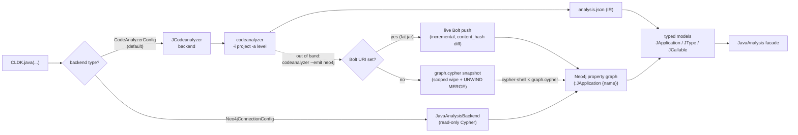

import { Steps, Aside, Tabs, TabItem } from "@astrojs/starlight/components";

codeanalyzer-java is the JVM analysis engine behind [CodeLLM-DevKit (CLDK)](https://github.com/codellm-devkit/python-sdk)'s Java support. The SDK doesn't re-implement Java analysis — it gets the analysis from this engine and wraps it in a typed facade so Python callers never touch the backend directly.

There are two ways it gets that analysis, and you pick between them by the **type** of object you pass to `backend=`:

- **`CodeAnalyzerConfig`** (the default) — the SDK runs `codeanalyzer` on your project, parses the resulting `analysis.json`, and builds the model in process. This is the classic flow: source in, models out.
- **`Neo4jConnectionConfig`** — the SDK becomes a **read-only Cypher client**. It reads a Neo4j property graph that some *other* job already populated with `codeanalyzer --emit neo4j`, and reconstructs the **same typed models** from the graph. No JDK, no analyzer binary, no project source on the consumer.

Both produce an identical `JavaAnalysis` facade. The second is the one that scales across a portfolio — more on that below.

## The flow



The left half is the in-process backend; the right half is the Neo4j backend. The dotted edges show how the graph gets there in the first place: an analyzer run with `--emit neo4j` projects the very same IR (the thing that would otherwise become `analysis.json`) into the graph, either as a re-runnable `graph.cypher` snapshot or as a live incremental Bolt push. Whichever path filled the graph, the SDK reads it back into the same Pydantic models.

## Default backend: running the analyzer

This is the in-process flow. If you don't pass `backend=`, CLDK shells out to `codeanalyzer`, parses `analysis.json`, and builds the model.

<Steps>

1. **Binary discovery** — if you don't point the SDK at a specific build, it locates a bundled `codeanalyzer` distribution from its package resources.
2. **Invocation** — it runs the analyzer over your project at the requested level (`codeanalyzer -i <project> -a <level> -o <tmpdir>`) and reads back the emitted `analysis.json`.
3. **Parsing** — the JSON is deserialized into Pydantic models: `JApplication` (the whole document), `JType`, `JCallable`, and the rest — mirroring the [output schema](/codeanalyzer-java/schema/).
4. **Facade** — the models are wrapped in `JavaAnalysis`, which exposes query methods like `get_classes()`, `get_methods_in_class()`, `get_call_graph()`, and `get_callers()`.

</Steps>

```python
from cldk import CLDK
from cldk.analysis import AnalysisLevel

# No backend= -> the default in-process JCodeanalyzer backend
analysis = CLDK.java(
    project_path="commons-cli",
    analysis_level=AnalysisLevel.call_graph,   # -> runs with -a 2
)

print(len(analysis.get_classes()), "classes")
print(analysis.get_call_graph())               # -> networkx.DiGraph
```

The `analysis_level` maps directly onto the analyzer's [`-a` flag](/codeanalyzer-java/reference/cli/): `AnalysisLevel.symbol_table` → `-a 1`, `AnalysisLevel.call_graph` → `-a 2`.

<Aside type="caution" title="Schema version compatibility">
The SDK's Pydantic models are locked to a compatible schema [version](/codeanalyzer-java/schema/#versioning-and-stability). If you point it at a build whose `analysis.json` version differs incompatibly, deserialization can warn or fail. Keep the analyzer and SDK versions aligned.
</Aside>

## Neo4j backend: reading from the graph

The default backend re-analyzes the project on every run, in process. That's fine for one project on a developer's laptop. It does **not** compose across a portfolio: every `analysis.json` is a standalone document that has to be loaded whole into memory, and forty services means forty JSON blobs and forty re-runs.

The Neo4j backend inverts this. Analysis is produced **once, centrally** — a CI or Kubernetes job runs `codeanalyzer --emit neo4j` and pushes an app-scoped subgraph into a shared Neo4j database (see the [Neo4j output guide](/codeanalyzer-java/guides/neo4j-output/)). Every consumer — agents, dashboards, and this SDK — is then a lightweight read-only client that just queries the graph. No analysis happens on the read side at all.

Pass a `Neo4jConnectionConfig` to `backend=` and the facade swaps onto the read-only `JavaAnalysisBackend`:

```python
from cldk import CLDK
from cldk.analysis import AnalysisLevel
from cldk.analysis.commons.backend_config import Neo4jConnectionConfig

analysis = CLDK.java(
    analysis_level=AnalysisLevel.call_graph,
    backend=Neo4jConnectionConfig(
        uri="bolt://localhost:7687",
        username="neo4j",
        password="neo4j",
        application_name="daytrader8",
    ),
)

symbol_table = analysis.get_symbol_table()              # Dict[str, JCompilationUnit]
cg = analysis.get_call_graph()                          # networkx.DiGraph
klass = analysis.get_class("com.example.MyService")     # JType
methods = analysis.get_methods_in_class("com.example.MyService")
```

The driver is an **optional dependency** — install it with the extra:

```bash
pip install "cldk[neo4j]"   # or: pip install neo4j
```

If the `neo4j` driver isn't installed, constructing the backend raises `CodeanalyzerExecutionException` with that install hint.

### Connection config

`Neo4jConnectionConfig` is a thin wrapper over the official `neo4j` Python driver. The driver is created with `GraphDatabase.driver(uri, auth=(username, password))` and every query runs in `session(database=database)`.

| Field | Default | Notes |
| --- | --- | --- |
| `uri` | *(required)* | Bolt URI of the Neo4j server, e.g. `bolt://localhost:7687`. |
| `username` | `"neo4j"` | **Read-only credentials are sufficient** — the SDK never writes. |
| `password` | `"neo4j"` | Read-only credentials are sufficient. |
| `database` | `None` | Database name; `None` uses the server's default database. |
| `application_name` | `None` | The `:JApplication` anchor to scope every query to. |

<Aside type="danger" title="application_name must match --app-name">
`application_name` **must equal the `--app-name`** the graph was loaded with. That value is the unique key of the `:JApplication` anchor node — it's how a single Neo4j database hosts many applications side by side without them clobbering each other.

If you omit it, the backend falls back to `Path(project_path).name` when a `project_path` was given; if it still can't resolve a name it raises `CodeanalyzerExecutionException("application_name is required to scope queries to an application.")`. In the example above the analyzer was run with `--app-name daytrader8`, so the SDK reads with `application_name="daytrader8"`.
</Aside>

Because the graph is external, **`project_path` is optional** for the Neo4j backend — there is no source tree to point at. The backend is also a context manager, so you can scope the driver's lifetime:

```python
import os

with CLDK.java(
    backend=Neo4jConnectionConfig(
        uri="bolt://neo4j.internal:7687",
        username="reader",            # read-only RBAC role
        password=os.environ["NEO4J_PASSWORD"],
        application_name="daytrader8",
    ),
) as analysis:
    entrypoints = analysis.get_entry_point_methods()
    cruds = analysis.get_all_crud_operations()
```

### What you get back

The backend doesn't return raw graph rows. It bulk-fetches nodes and relationships in a handful of Cypher queries and **reconstructs the canonical `JApplication`** — handing an `analysis.json`-shaped payload to `JApplication(**payload)` — exactly the model the in-process analyzer would have built. So the `get_*` methods return the **identical typed objects** (`JType`, `JCallable`, a `networkx.DiGraph` call graph) regardless of which backend produced them:

```python
# Same methods, same return types, whichever backend you chose
analysis.get_symbol_table()        # Dict[str, JCompilationUnit]
analysis.get_classes()             # all JType nodes for this application
analysis.get_class(fqn)            # one JType
analysis.get_methods_in_class(fqn) # callables in a class
analysis.get_callers(...)          # who calls this (level 2)
analysis.get_callees(...)          # what this calls (level 2)
analysis.get_entry_point_methods()
analysis.get_all_crud_operations()
```

A `get_call_graph()` over the Neo4j backend reads the projected `J_CALLS` edges directly out of the graph:

```cypher
MATCH (app:JApplication {name: $appName})-[:J_HAS_UNIT]->(:JCompilationUnit)
      -[:J_DECLARES_TYPE]->(:JType)-[:J_HAS_CALLABLE]->(caller:JCallable)
MATCH (caller)-[:J_CALLS]->(callee:JCallable)
RETURN caller.id AS source, callee.id AS target
```

### Caveats and version requirements

<Aside type="note" title="Read this before you trust parity">
- **`J_CALLS` only exists at `-a 2`.** The graph carries call-graph edges only if the analyzer ran at analysis level 2. If the application was projected at level 1 (symbol table only), `get_call_graph()` has the types and methods but no call edges — the same limitation as a level-1 `analysis.json`.
- **`J_CALLS` is gated to resolved application callables.** A call edge is kept only when *both* endpoints were emitted as `:JCallable` nodes, so calls into external libraries (JDK, third-party jars) don't appear as `J_CALLS` edges. This matches the in-memory call graph.
- **Projection-lossy fields.** Parity with the in-memory backend holds *modulo* a few documented gaps — for instance comments collapse to a docstring on the owning node. The schema is a [lossless projection of the IR](/codeanalyzer-java/schema/neo4j-graph/) for structure; the small deltas are around comments and external call targets.
- **Emitter version.** The graph must be produced by a `codeanalyzer-java` emitter **≥ 2.4.0**. Several projection fixes (issues #156 / #157 / #158 — e.g. multi-declarator fields kept as distinct nodes, single-type imports linked to a `:JType` rather than collapsed to a `:JPackage`) landed in **2.4.1**, so prefer **≥ 2.4.1** for full SDK parity.
</Aside>

## Choosing a backend

<Tabs>
<TabItem label="In-process (default)">

Use when you have the project source on hand and want a self-contained, one-shot analysis — local development, a single repo in CI, a notebook.

```python
analysis = CLDK.java(
    project_path="my_project",
    analysis_level=AnalysisLevel.call_graph,
)
```

Every run re-analyzes the project; nothing is shared between runs or services.

</TabItem>
<TabItem label="Neo4j (read-only)">

Use when analysis is produced centrally and read in many places — agents, dashboards, cross-service queries — without shipping the JDK, the analyzer binary, or the source to every consumer.

```python
analysis = CLDK.java(
    analysis_level=AnalysisLevel.call_graph,
    backend=Neo4jConnectionConfig(
        uri="bolt://neo4j.internal:7687",
        password=os.environ["NEO4J_PASSWORD"],
        application_name="daytrader8",
    ),
)
```

Analysis is produced once by a separate `--emit neo4j` job; reads scale independently and cost a Cypher query.

</TabItem>
</Tabs>

The whole point of the Neo4j backend is that **the read side carries no analysis dependency**. Forty services analyzed by forty Kubernetes jobs land in one cluster, each anchored at its own `:JApplication`, and a single SDK client queries across all of them by `application_name` — a graph traversal, not forty JSON parses.

## Pointing at a custom build

To use an analyzer you built yourself — say, a local development build — pass `analysis_backend_path` (a directory containing the analyzer distribution):

```python
analysis = CLDK.java(
    project_path="my_project",
    analysis_level=AnalysisLevel.call_graph,
    analysis_backend_path="/path/containing/codeanalyzer",
)
```

This is the bridge between this repo and the SDK: build it ([Installation](/codeanalyzer-java/installing/)), then point the SDK at your build output. This applies to the **in-process** backend only — the Neo4j backend has no analyzer to locate, since the graph was populated out of band.

## See also

- [Neo4j graph output](/codeanalyzer-java/guides/neo4j-output/) — how to populate the graph with `--emit neo4j`, snapshot vs. live Bolt, and the producer/consumer deployment model.
- [Neo4j graph schema](/codeanalyzer-java/schema/neo4j-graph/) — the node labels, `J_*` relationships, constraints, and indexes the backend reads.
- [CLI options](/codeanalyzer-java/reference/cli/) — `--emit`, `--app-name`, and the `--neo4j-*` connection flags.

For the bigger picture — concepts, agent recipes, the cross-language API — see the main [CodeLLM-DevKit documentation](https://codellm-devkit.info).
