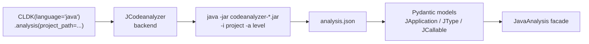

import { Steps, Aside } from "@astrojs/starlight/components";

codeanalyzer-java is the JVM analysis engine behind [CodeLLM-DevKit (CLDK)](https://github.com/codellm-devkit/python-sdk)'s Java support. The SDK doesn't re-implement Java analysis — it runs this JAR, parses the resulting `analysis.json`, and wraps it in a typed facade so Python callers never touch the backend directly.

## The flow



<Steps>

1. **JAR discovery** — if you don't pass `analysis_backend_path`, the SDK locates a bundled `codeanalyzer-*.jar` from its package resources.
2. **Invocation** — it runs `java -jar codeanalyzer-*.jar -i <project> -a <level> -o <tmpdir>` (or reads JSON from stdout).
3. **Parsing** — the JSON is deserialized into Pydantic models: `JApplication` (the whole document), `JType`, `JCallable`, and the rest — mirroring the [output schema](/codeanalyzer-java/schema/).
4. **Facade** — the models are wrapped in `JavaAnalysis`, which exposes query methods like `get_classes()`, `get_methods_in_class()`, `get_call_graph()`, and `get_callers()`.

</Steps>

## Basic usage

```python
from cldk import CLDK
from cldk.analysis import AnalysisLevel

# language="java" -> the JCodeanalyzer backend
analysis = CLDK(language="java").analysis(
    project_path="commons-cli",
    analysis_level=AnalysisLevel.call_graph,   # -> runs with -a 2
)

print(len(analysis.get_classes()), "classes")
print(analysis.get_call_graph())               # -> networkx.DiGraph
```

The `analysis_level` maps directly onto the JAR's [`-a` flag](/codeanalyzer-java/reference/cli/): `AnalysisLevel.symbol_table` → `-a 1`, `AnalysisLevel.call_graph` → `-a 2`.

## Pointing at a custom JAR

To use a JAR you built yourself — say, a local development build — pass `analysis_backend_path` (a directory containing a `codeanalyzer-*.jar`):

```python
analysis = CLDK(language="java").analysis(
    project_path="my_project",
    analysis_level=AnalysisLevel.call_graph,
    analysis_backend_path="/path/containing/codeanalyzer-2.3.7.jar",
)
```

This is the bridge between this repo and the SDK: build with `./gradlew fatJar` ([Installation](/codeanalyzer-java/installing/)), then point the SDK at `build/libs`.

<Aside type="caution" title="Schema version compatibility">
The SDK's Pydantic models are locked to a compatible schema [version](/codeanalyzer-java/schema/#versioning-and-stability). If you point it at a JAR whose `analysis.json` version differs incompatibly, deserialization can warn or fail. Keep the JAR and SDK versions aligned.
</Aside>

## What the facade gives you

Once you have a `JavaAnalysis` object, the underlying `analysis.json` is fully abstracted. Common queries:

```python
# Structure (from the symbol table)
analysis.get_classes()                         # all types
analysis.get_methods_in_class(cls)             # callables in a class
analysis.get_method(cls, signature)            # one callable, with body

# Relationships (from the call graph, level 2)
cg = analysis.get_call_graph()                 # networkx.DiGraph
analysis.get_callers(cls, signature)           # who calls this
```

For the bigger picture — concepts, agent recipes, the cross-language API — see the main [CodeLLM-DevKit documentation](https://codellm-devkit.info).
