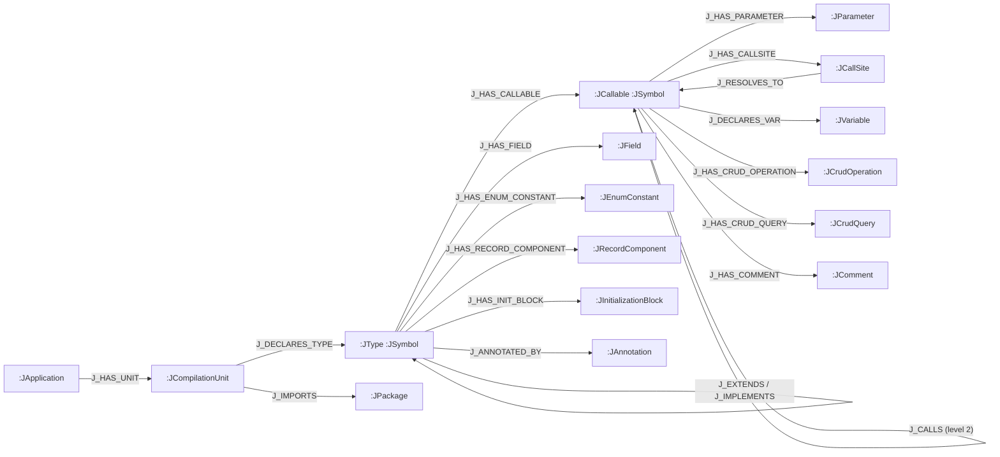

import Neo4jPropertyGraph from '../../../components/Neo4jPropertyGraph.astro';
import { Aside } from "@astrojs/starlight/components";

`--emit neo4j` projects the same analysis IR you get from `analysis.json` into a **Neo4j property graph** instead of a file. Nothing is dropped: every compilation unit, type, callable, field, parameter, call site, variable, enum constant, record component, initializer block, CRUD operation/query, comment, annotation, and package becomes a first-class node or relationship. This page is the contract for that graph — the labels, the relationships, the keys, and the DDL — and is generated from the same source as the machine-readable [`schema.neo4j.json`](#the-schema-contract).

<Neo4jPropertyGraph />

Why a graph instead of one big JSON document? An `analysis.json` describes exactly one application and must be loaded whole into memory to be useful. The graph composes: many applications live in one Neo4j database, each anchored at its own `:JApplication` node, and you query across all of them in Cypher rather than parsing giant blobs. Whole-monorepo and cross-service questions become a graph traversal, not a memory problem. The graph is the same lossless model — just persistent, queryable, and shared.

<Aside type="note" title="Where the values come from">
This schema is the projection of the [symbol table](/codeanalyzer-java/schema/symbol-table/) and [call graph](/codeanalyzer-java/schema/call-graph/). Node properties carry the same `snake_case` field names you see in `analysis.json` (see [serialization conventions](/codeanalyzer-java/schema/#serialization-conventions)). The `J_CALLS` relationship is the level-2 call graph; everything else is level-1 structure.
</Aside>

## Topology at a glance

The graph is rooted at a single `:JApplication` anchor and fans out through the compilation units it owns. The diagram below mirrors the canonical `neo4j-schema.drawio`; the `J_CALLS` edge (drawn dashed) is added only at [analysis level 2](/codeanalyzer-java/guides/analysis-levels/).



The `(:JApplication)-[:J_HAS_UNIT]->(:JCompilationUnit)` edge is the **scoping spine**: every project-owned node is reachable from exactly one application anchor. That is what lets one database host many apps without them colliding — and what `--app-name` controls.

## Node labels

Sixteen node labels, all `J`-prefixed. The `key` column is the property each label MERGEs on; it is enforced by a uniqueness constraint (see [DDL](#constraints-and-indexes)).

| Label | Key | Notable properties |
|-------|-----|--------------------|
| `:JApplication` | `name` | `name`, `schema_version` |
| `:JCompilationUnit` | `file_key` | `file_path`, `package_name`, `content_hash`, `comment_count`, `is_modified`, `_module` |
| `:JType` | `id` | `fqn`, `name`, `kind`, `modifiers`, `annotations`, `extends_list`, `implements_list`, `is_interface`, `is_entrypoint_class` |
| `:JCallable` | `id` | `signature`, `return_type`, `parameter_types`, `code`, `cyclomatic_complexity`, `is_constructor`, `is_entrypoint` |
| `:JField` | `id` | `name`, `type`, `modifiers`, `annotations`, `variables`, `variable_initializers_json`, `_module` |
| `:JParameter` | `id` | `name`, `type`, `annotations`, `modifiers`, `_module` |
| `:JVariable` | `id` | `name`, `type`, `initializer`, `_module` |
| `:JCallSite` | `id` | `method_name`, `receiver_type`, `callee_signature`, `is_static_call`, `is_constructor_call`, `_module` |
| `:JEnumConstant` | `id` | `name`, `arguments`, `_module` |
| `:JRecordComponent` | `id` | `name`, `type`, `default_value`, `is_var_args`, `_module` |
| `:JInitializationBlock` | `id` | `file_path`, `code`, `is_static`, `cyclomatic_complexity`, `_module` |
| `:JCrudOperation` | `id` | `operation_type`, `target_table`, `involved_columns`, `condition`, `joined_tables`, `_module` |
| `:JCrudQuery` | `id` | `query_type`, `query_arguments`, `_module` |
| `:JComment` | `id` | `content`, `is_javadoc`, `_module` |
| `:JPackage` | `name` | `name` |
| `:JAnnotation` | `name` | `name` |

### Identity, merge labels, and the entrypoint marker

A few conventions make the keys above unambiguous:

- **`:JType` and `:JCallable` also carry a shared `:JSymbol` label.** That is the global-identity / MERGE key for anything that can be referenced from elsewhere in the graph. A single constraint on `:JSymbol(id)` enforces that no two symbols collide, across all types and callables. A type's `id` is its **fully-qualified name** (`com.example.MyService`); a callable's `id` is `<fqn>#<signature>` (`com.example.MyService#doWork(java.lang.String)`), so overloads stay distinct.
- **`:JCompilationUnit` keys on `file_key`, which is the file path.** `file_key` is the unique merge key; `file_path` is the same string carried as an ordinary property for convenience.
- **`:JEntrypoint` is a marker label, not a node type.** It is added to the owning `:JCallable` (or `:JType`) when that element is a `main` method or a recognized [framework entry point](/codeanalyzer-java/frameworks/entry-points/). Find every entry point with `MATCH (c:JEntrypoint)`.

<Aside type="note" title="`_module` provenance">
Every project-owned leaf node (parameters, variables, call sites, fields, comments, …) carries an internal `_module` property equal to the `file_key` of the compilation unit it came from. It lets the incremental Bolt writer replace exactly one file's subgraph without touching the rest, and lets you trace any node back to its source file in one hop.
</Aside>

### Shared vs. app-scoped nodes

`:JPackage` and `:JAnnotation` are keyed only by `name` and are **shared across applications** in the same database — `java.util` is `java.util` for everyone. Every other node hangs off the `:JApplication` spine and belongs to exactly one app. The [per-application wipe](#multi-tenancy-and-the-app-name-anchor) deletes an app's own subgraph while leaving these shared nodes intact.

## Relationship types

Twenty relationship types, all `J_`-prefixed. Endpoints with a `|` accept any of the listed labels.

| Relationship | From → To | Properties |
|--------------|-----------|------------|
| `J_HAS_UNIT` | `:JApplication` → `:JCompilationUnit` | — |
| `J_DECLARES_TYPE` | `:JCompilationUnit` → `:JType` | — |
| `J_HAS_NESTED_TYPE` | `:JType` → `:JType` | — |
| `J_HAS_CALLABLE` | `:JType` → `:JCallable` | — |
| `J_HAS_FIELD` | `:JType` → `:JField` | — |
| `J_HAS_PARAMETER` | `:JCallable` → `:JParameter` | — |
| `J_HAS_CALLSITE` | `:JCallable` \| `:JInitializationBlock` → `:JCallSite` | — |
| `J_DECLARES_VAR` | `:JCallable` \| `:JInitializationBlock` → `:JVariable` | — |
| `J_HAS_ENUM_CONSTANT` | `:JType` → `:JEnumConstant` | — |
| `J_HAS_RECORD_COMPONENT` | `:JType` → `:JRecordComponent` | — |
| `J_HAS_INIT_BLOCK` | `:JType` → `:JInitializationBlock` | — |
| `J_EXTENDS` | `:JType` → `:JType` | gated |
| `J_IMPLEMENTS` | `:JType` → `:JType` | gated |
| `J_ANNOTATED_BY` | `:JType` \| `:JCallable` \| `:JField` → `:JAnnotation` | — |
| `J_IMPORTS` | `:JCompilationUnit` → `:JType` \| `:JPackage` | `path`, `is_static`, `is_wildcard` |
| `J_RESOLVES_TO` | `:JCallSite` → `:JCallable` | gated |
| `J_CALLS` | `:JCallable` → `:JCallable` | `type`, `weight`, `source_kind`, `destination_kind` — gated, level 2 only |
| `J_HAS_CRUD_OPERATION` | `:JCallable` \| `:JCallSite` → `:JCrudOperation` | — |
| `J_HAS_CRUD_QUERY` | `:JCallable` \| `:JCallSite` → `:JCrudQuery` | — |
| `J_HAS_COMMENT` | `:JCompilationUnit` \| `:JType` \| `:JCallable` \| `:JField` \| `:JCallSite` \| `:JVariable` \| `:JRecordComponent` \| `:JInitializationBlock` → `:JComment` | — |

A single-type import (`import com.example.Foo;`) links to the `:JType`; a wildcard or static import links to the `:JPackage`. The `J_IMPORTS` edge carries `path`, `is_static`, and `is_wildcard` so the three cases stay distinguishable.

<Aside type="caution" title="Gated edges">
`J_EXTENDS`, `J_IMPLEMENTS`, `J_RESOLVES_TO`, and `J_CALLS` are **gated**: an edge is kept only when *both* endpoints were emitted as nodes. A class that extends a JDK or third-party type whose source isn't in the project gets no `J_EXTENDS` edge (the supertype isn't a node), and a call into a library method gets no `J_CALLS` edge. This mirrors the `analysis.json` call graph, which also only resolves edges between callables it analyzed. `J_CALLS` additionally requires [analysis level 2](/codeanalyzer-java/guides/analysis-levels/) — at level 1 the graph is the lossless symbol table with no resolved call edges.
</Aside>

## Constraints and indexes

The writers run this DDL before any load, so every `MERGE` is an index seek rather than a label scan and the identity invariants are enforced by the database. Every statement is idempotent (`IF NOT EXISTS`).

**15 uniqueness constraints** — one per keyed label. The first is the global identity constraint that backs the shared `:JSymbol` merge:

```cypher
CREATE CONSTRAINT j_symbol_id        IF NOT EXISTS FOR (s:JSymbol)          REQUIRE s.id IS UNIQUE;
CREATE CONSTRAINT j_application_name IF NOT EXISTS FOR (a:JApplication)     REQUIRE a.name IS UNIQUE;
CREATE CONSTRAINT j_compilation_unit_key IF NOT EXISTS FOR (c:JCompilationUnit) REQUIRE c.file_key IS UNIQUE;
-- … plus JPackage.name, JAnnotation.name, and per-id constraints on
--    JCallSite, JField, JParameter, JVariable, JEnumConstant,
--    JRecordComponent, JInitializationBlock, JCrudOperation,
--    JCrudQuery, and JComment (15 total).
```

**4 indexes**, including a fulltext index over callable source for code search:

```cypher
CREATE INDEX j_callable_name      IF NOT EXISTS FOR (c:JCallable)  ON (c.name);
CREATE INDEX j_type_name          IF NOT EXISTS FOR (t:JType)      ON (t.name);
CREATE INDEX j_annotation_name_idx IF NOT EXISTS FOR (an:JAnnotation) ON (an.name);
CREATE FULLTEXT INDEX j_code_fts  IF NOT EXISTS FOR (c:JCallable)  ON EACH [c.code, c.docstring];
```

The `j_code_fts` fulltext index lets you search method bodies and docstrings directly:

```cypher
CALL db.index.fulltext.queryNodes('j_code_fts', 'executeQuery AND prepareStatement')
YIELD node, score
RETURN node.signature, score
ORDER BY score DESC;
```

## Multi-tenancy and the `--app-name` anchor

`--app-name` names the single `:JApplication` anchor that scopes everything you push. It defaults to the base name of the `-i` input directory (and is the literal `application` when there is no input). Because the anchor name is unique (`j_application_name`), one Neo4j database can host many applications side by side, each rooted at its own anchor — and you query across them, or scope to one, in Cypher.

```cypher
// Every callable in one application
MATCH (a:JApplication {name: 'daytrader8'})-[:J_HAS_UNIT]->(:JCompilationUnit)
      -[:J_DECLARES_TYPE]->(:JType)-[:J_HAS_CALLABLE]->(c:JCallable)
RETURN count(c);

// Cross-application: which apps declare a type named "AccountServiceImpl"?
MATCH (a:JApplication)-[:J_HAS_UNIT]->(:JCompilationUnit)
      -[:J_DECLARES_TYPE]->(t:JType {name: 'AccountServiceImpl'})
RETURN a.name, t.fqn;
```

Re-pushing an app is scoped, too. The `graph.cypher` snapshot wipes only the named app's prior subgraph — `MATCH (a:JApplication {name: <appName>})` then `DETACH DELETE` its units and descendants — leaving other apps and the shared `:JPackage` / `:JAnnotation` nodes untouched. The live Bolt writer goes further: it diffs each compilation unit's `content_hash` against the database and replaces **only the changed units' subgraphs**, pruning units whose source file vanished on a full run (pruning is skipped on a `-t` targeted run). See [the two emit modes](#producing-the-graph) below.

<Aside type="note" title="Coexistence with the other backends">
Because all labels are `J`-prefixed and all relationships `J_`-prefixed, a Java graph shares a database cleanly with the Python (`Py*` / `PY_*`) and TypeScript (`TS*` / `TS_*`) backends — no collisions. A polyglot service's Java, Python, and TypeScript components can live in one graph and be queried together.
</Aside>

## Producing the graph

`--emit neo4j` has two sub-modes, decided purely by whether a Bolt URI resolved (the `--neo4j-uri` flag or the `NEO4J_URI` environment variable):

- **No URI → `graph.cypher` snapshot.** A self-contained, re-runnable Cypher script: the DDL above, a scoped wipe of this app's prior subgraph, then batched `UNWIND … MERGE` for nodes and edges. It expresses the *full* truth of the analysis and is **not** incremental. Load it with `cypher-shell`.
- **URI present → live incremental Bolt push.** The Bolt writer ensures the DDL, content-hash-diffs each compilation unit against the live database, and upserts **only what changed** via idempotent `MERGE`. Shared `:JPackage` / `:JAnnotation` nodes are MERGE-only.

```bash
# Snapshot: write graph.cypher, then load it
codeanalyzer -i /path/to/project -a 2 --emit neo4j --app-name daytrader8 -o ./out
cypher-shell -u neo4j -p "$NEO4J_PASSWORD" < ./out/graph.cypher

# Live incremental push over Bolt (NEO4J_PASSWORD from the environment)
export NEO4J_PASSWORD=…
codeanalyzer -i /path/to/project -a 2 --emit neo4j --app-name daytrader8 \
  --neo4j-uri bolt://localhost:7687 --neo4j-user neo4j --neo4j-database neo4j
```

`SCHEMA_VERSION` (currently `1.0.0`) is stamped on the `:JApplication` node of every emitted graph, so consumers can check the contract version before querying.

<Aside type="caution" title="Native binary: the live push degrades to a snapshot">
The Neo4j driver is deliberately **not** bundled in the GraalVM native image (it is loaded reflectively so native-image can prune the driver and Netty). In the prebuilt native binary, passing `--neo4j-uri` therefore degrades gracefully — it writes `graph.cypher` and logs a warning instead of pushing. The real live Bolt push happens from the fat jar (`java -jar codeanalyzer.jar …`). Use the jar when you need the incremental push.
</Aside>

## The schema contract

`--emit schema` prints this entire schema as machine-readable JSON — labels, relationships, constraints, and indexes — without analyzing any project:

```bash
codeanalyzer --emit schema -o ./out   # → ./out/schema.neo4j.json (stdout if -o is omitted)
```

The document is `schema.neo4j.json` (`schema_version` `1.0.0`). A conformance test asserts the projector never emits a label, relationship, or property the catalog doesn't declare, and that the checked-in `schema.neo4j.json` is current — so this page and the database stay in lockstep with the code.

## Reading the graph from the Python SDK

The big payoff: once a graph exists, the [CLDK Python SDK](/codeanalyzer-java/integration/python-sdk/) reads the **same typed model** back out of Neo4j without re-analyzing anything. There is **no JDK, no native binary, and no project source** on the consumer — only the Bolt URI and read-only credentials. Analysis is produced once, centrally, and read cheaply everywhere.

```python
# Read-only Neo4j backend — no analyzer engine, no JDK, no project source
from cldk import CLDK
from cldk.analysis import AnalysisLevel
from cldk.analysis.commons.backend_config import Neo4jConnectionConfig

analysis = CLDK.java(
    analysis_level=AnalysisLevel.call_graph,
    backend=Neo4jConnectionConfig(
        uri="bolt://localhost:7687",
        username="neo4j",
        password="neo4j",                 # read-only credentials suffice
        application_name="daytrader8",    # == the --app-name the graph was pushed with
    ),
)

symbol_table = analysis.get_symbol_table()              # Dict[str, JCompilationUnit]
cg = analysis.get_call_graph()                          # networkx.DiGraph
klass = analysis.get_class("com.example.AccountServiceImpl")
methods = analysis.get_methods_in_class("com.example.AccountServiceImpl")
```

The backend bulk-fetches nodes and relationships in a handful of Cypher queries and rebuilds the *same* canonical `JApplication` — symbol table of `JCompilationUnit` plus the `networkx` call graph — that the in-process analyzer produces. The `get_*` methods (`get_classes`, `get_methods`, `get_callers`, `get_callees`, `get_entry_point_methods`, `get_all_crud_operations`, …) return the identical typed objects (`JType`, `JCallable`).

<Aside type="note" title="Scoping and install">
`application_name` must equal the `--app-name` the graph was pushed with — it is what scopes every query to the right `:JApplication`. The driver is an optional dependency: `pip install cldk[neo4j]` (or `pip install neo4j`). Because the graph is external, `project_path` is optional for the Neo4j backend, and the connection is a context manager (`with …` / `.close()`). Parity with the in-memory backend holds modulo documented projection-lossy fields (comments collapse to a docstring; call edges to external/library targets may be absent — the same gating described [above](#gated-edges)).
</Aside>
