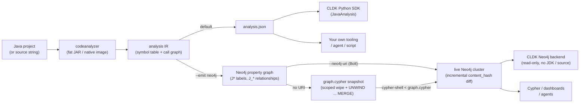

import Neo4jPropertyGraph from '../../components/Neo4jPropertyGraph.astro';
import { Aside, LinkCard, CardGrid } from "@astrojs/starlight/components";

**codeanalyzer-java** is a standalone, self-contained JVM tool that performs static analysis on enterprise Java applications. You hand it a project (or a single source string); it extracts a comprehensive symbol table and, at analysis level 2, an interprocedural call graph — and emits them either as the canonical `analysis.json` document or as a **Neo4j property graph** (`--emit neo4j`).

It is the JVM analysis engine behind [CodeLLM-DevKit (CLDK)](https://github.com/codellm-devkit/python-sdk)'s Java support. The Python SDK does not re-implement Java analysis — it either shells out to this binary and deserializes the JSON into typed models, or, when you point it at Neo4j, reads the same typed models straight from the graph. You can also run the binary directly and consume the output yourself.

<Neo4jPropertyGraph />

## The mental model



There are a few things to keep straight:

1. **The project** — the Java source you want to understand. codeanalyzer can resolve types either from a built project's dependencies or from a single in-memory source string.
2. **The binary** — `codeanalyzer`, a single fat JAR (or a GraalVM native image) bundling WALA, Javaparser, and everything else. No server, no database are required *to run it*; it reads source/binaries and writes its output.
3. **The output** — by default a versioned `analysis.json` with `symbol_table` and (at analysis level 2) `call_graph` keys. With `--emit neo4j`, the same intermediate representation is instead projected into a Neo4j property graph — losslessly, as first-class nodes and relationships.

## Two analysis engines, one IR, two outputs

codeanalyzer-java combines two complementary static-analysis technologies:

- **Javaparser + Symbol Solver** does the *syntactic* work — parsing `.java` files into ASTs and resolving types — to build the **symbol table**: every class, interface, enum, and record, with their fields, methods, constructors, comments, and imports.
- **WALA** (the T.J. Watson Libraries for Analysis) does the *semantic* work — building a class hierarchy and an interprocedural **call graph** from the compiled program.

The symbol table is always produced. The call graph is produced only when you ask for analysis level 2 (`-a 2`). That single intermediate representation is then serialized one of two ways — and the output target is an *alternative*, not additive:

- `--emit json` (the default) writes `analysis.json`.
- `--emit neo4j` projects the IR into a graph instead and returns **without** writing `analysis.json`.

See [Architecture](/codeanalyzer-java/guides/architecture/) and [Analysis levels](/codeanalyzer-java/guides/analysis-levels/).

<Aside type="note" title="Why one schema matters">
Both outputs are versioned contracts. Each `analysis.json` carries a `version` field (e.g. `"2.3.7"`), and every emitted graph stamps `schema_version` `1.0.0` on its `:JApplication` anchor node. That stability is what lets CLDK's models — and your own consumers — deserialize the output reliably across runs, across backends, and across languages. You can publish the graph contract on its own with `--emit schema`, which prints `schema.neo4j.json` and requires no project analysis at all.
</Aside>

## The Neo4j property graph

`--emit neo4j` turns a per-project JSON file into a **queryable, persistent system of record**. The graph is a lossless projection of the IR: compilation units, types, callables, fields, parameters, call sites, variables, enum constants, record components, initialization blocks, CRUD operations and queries, comments, annotations, and packages all become first-class nodes. Java labels are `J`-prefixed and relationship types `J_`-prefixed (e.g. `(:JApplication)-[:J_HAS_UNIT]->(:JCompilationUnit)`, `(:JCallable)-[:J_CALLS]->(:JCallable)`), so a Java graph can share one Neo4j database with the Python (`Py*`/`PY_*`) and TypeScript (`TS*`/`TS_*`) backends without colliding.

Every application is anchored at its own `:JApplication` node, keyed by `--app-name`. That anchor is the **tenancy boundary**: one Neo4j database can host many applications side by side, each rooted at its own `:JApplication`, and you query across all of them with Cypher instead of loading giant JSON blobs into memory. Whole-monorepo and cross-service analysis becomes a graph traversal, not a memory problem.

There are two emit modes, decided purely by whether a Bolt URI resolves (from `--neo4j-uri` or the `NEO4J_URI` env var):

- **No URI → a `graph.cypher` snapshot.** Self-contained and re-runnable: constraints and indexes, a scoped wipe of *this* application's prior subgraph, then batched `UNWIND ... MERGE` loads of the full truth. The snapshot is not incremental — it expresses the whole current state — and you load it with `cypher-shell < graph.cypher`.
- **URI present → a live, incremental Bolt push.** The writer reads the database's current state and updates only what changed: it diffs each compilation unit's `content_hash` (SHA-256 over the unit) against the live DB, replaces only changed units' subgraphs via idempotent `MERGE` upserts, upserts shared `:JPackage`/`:JAnnotation` nodes MERGE-only, and on a full run prunes units whose source file has vanished (orphan pruning is skipped on a targeted `-t` run).

```bash
# Snapshot: no URI, writes ./graph.cypher
codeanalyzer -i /path/to/daytrader8 -a 2 --emit neo4j --app-name daytrader8

# Live incremental push over Bolt (prefer the NEO4J_PASSWORD env var)
export NEO4J_PASSWORD=secret
codeanalyzer -i /path/to/daytrader8 -a 2 --emit neo4j \
  --app-name daytrader8 \
  --neo4j-uri bolt://localhost:7687 \
  --neo4j-user neo4j \
  --neo4j-database neo4j
```

<Aside type="caution" title="Native-image caveat">
The Neo4j driver is deliberately **not** bundled in the GraalVM native binary (it is loaded reflectively so native-image can prune the driver and Netty). In the prebuilt native binary, `--neo4j-uri` therefore degrades gracefully to writing a `graph.cypher` snapshot, with a warning. The real live Bolt push happens from the fat jar (`java -jar`). Use the jar in your producer job when you want incremental pushes.
</Aside>

Once the graph exists, the Python SDK can read from it instead of re-analyzing. Point CLDK at the Bolt URI with a `Neo4jConnectionConfig` and it reconstructs the **same** typed `JApplication` (symbol table + `networkx` call graph) as the in-process analyzer — with no JDK, no native binary, and no project source on the consumer. It only needs the graph and read-only credentials. The `application_name` here must match the `--app-name` the graph was loaded with:

```python
# Java project — read-only Neo4j backend (no JDK, no binary, no source)
from cldk import CLDK
from cldk.analysis import AnalysisLevel
from cldk.analysis.commons.backend_config import Neo4jConnectionConfig

analysis = CLDK.java(
    analysis_level=AnalysisLevel.call_graph,
    backend=Neo4jConnectionConfig(
        uri="bolt://localhost:7687",
        username="neo4j",
        password="neo4j",                 # read-only credentials suffice
        application_name="daytrader8",    # == the producer's --app-name
    ),
)
symbol_table = analysis.get_symbol_table()  # Dict[str, JCompilationUnit]
cg = analysis.get_call_graph()              # networkx.DiGraph
klass = analysis.get_class("com.example.MyService")
methods = analysis.get_methods_in_class("com.example.MyService")
```

This is the enterprise unlock: analysis is **produced once, centrally** (a CI / Kubernetes Job or CronJob running the jar pushes app-scoped subgraphs into a shared cluster) and **read cheaply everywhere** (agents, the SDK, and dashboards are lightweight read-only clients that scale independently of the heavier analysis pods). See [Reading from Neo4j with the Python SDK](/codeanalyzer-java/integration/python-sdk/) and the [Neo4j graph schema](/codeanalyzer-java/schema/).

## What it is good at

- **Enterprise Java** — it understands Maven and Gradle projects, downloads dependencies for type resolution, and recognizes Spring, JAX-RS, Struts, and Servlet entry points.
- **Structured output for tools** — the output is meant to be consumed by code, not read by humans. Method bodies, source spans, cyclomatic complexity, call sites, and accessed fields are all captured.
- **Reachability groundwork** — the call graph is explicit caller→callee edges, ready to load into a graph library and query.
- **Graph-native consumption at portfolio scale** — with `--emit neo4j`, reachability and cross-service queries run as Cypher traversals over a persistent, multi-application graph. A fulltext index (`j_code_fts`) over callable code and docstrings makes the same graph searchable, and read-only credentials / RBAC let many consumers depend on it as governed infrastructure.

## What it is not

- It is **not** a linter or a bug finder — it extracts facts, it does not pass judgment.
- It is **not** an incremental *server* — each invocation is a batch run. The Bolt push is still a batch invocation; it just updates the graph *incrementally* (content-hash diff, only changed units re-pushed) instead of rewriting it. The default JSON path writes a fresh `analysis.json` each run, though [incremental target-file analysis](/codeanalyzer-java/guides/incremental-analysis/) can patch an existing one.
- It does **not** require the Python SDK — that is one consumer among several. And the SDK, in turn, does **not** require this binary when it reads from Neo4j: the graph is populated out of band, and the SDK only polls it.

## Next steps

<CardGrid>
  <LinkCard title="Quickstart" description="Build the JAR and analyze a project." href="/codeanalyzer-java/quickstart/" />
  <LinkCard title="Architecture" description="How the Javaparser and WALA pipelines fit together." href="/codeanalyzer-java/guides/architecture/" />
  <LinkCard title="Output schema" description="The full shape of analysis.json and the Neo4j property graph." href="/codeanalyzer-java/schema/" />
  <LinkCard title="Python SDK integration" description="How CLDK uses this backend — JSON or Neo4j." href="/codeanalyzer-java/integration/python-sdk/" />
</CardGrid>
