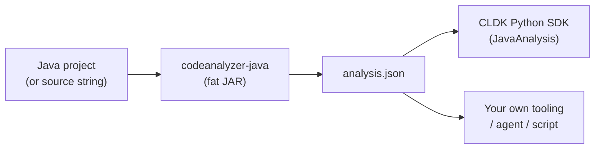

import { Aside, LinkCard, CardGrid } from "@astrojs/starlight/components";

**codeanalyzer-java** is a standalone, self-contained JVM tool that performs static analysis on enterprise Java applications. You hand it a project (or a single source string); it hands you back one JSON document — `analysis.json` — describing the program's structure and, optionally, its interprocedural call graph.

It is the JVM analysis engine behind [CodeLLM-DevKit (CLDK)](https://github.com/codellm-devkit/python-sdk)'s Java support. The Python SDK does not re-implement Java analysis — it shells out to this JAR and deserializes the JSON into typed models. You can also run the JAR directly and consume the JSON yourself.

## The mental model

There are three things to keep straight:

1. **The project** — the Java source you want to understand. codeanalyzer can resolve types either from a built project's dependencies or from a single in-memory source string.
2. **The JAR** — a single fat JAR bundling WALA, Javaparser, and everything else. No server, no database; it reads source/binaries and writes JSON.
3. **`analysis.json`** — a versioned document with two top-level keys, `symbol_table` and (at analysis level 2) `call_graph`, plus a `version` string.

## Two analysis engines, one output

codeanalyzer-java combines two complementary static-analysis technologies:

- **Javaparser + Symbol Solver** does the *syntactic* work — parsing `.java` files into ASTs and resolving types — to build the **symbol table**: every class, interface, enum, and record, with their fields, methods, constructors, comments, and imports.
- **WALA** (the T.J. Watson Libraries for Analysis) does the *semantic* work — building a class hierarchy and an interprocedural **call graph** from the compiled program.

The symbol table is always produced. The call graph is produced only when you ask for analysis level 2. See [Architecture](/codeanalyzer-java/guides/architecture/) and [Analysis levels](/codeanalyzer-java/guides/analysis-levels/).

<Aside type="note" title="Why one schema matters">
The JSON shape is stable and versioned (each `analysis.json` carries a `version` field, e.g. `"2.3.7"`). That contract is what lets CLDK's Pydantic models — and your own consumers — deserialize the output reliably across runs and across languages.
</Aside>

## What it is good at

- **Enterprise Java** — it understands Maven and Gradle projects, downloads dependencies for type resolution, and recognizes Spring, JAX-RS, Struts, and Servlet entry points.
- **Structured output for tools** — the JSON is meant to be consumed by code, not read by humans. Method bodies, source spans, cyclomatic complexity, call sites, and accessed fields are all captured.
- **Reachability groundwork** — the call graph is explicit caller→callee edges, ready to load into a graph library and query.

## What it is not

- It is **not** a linter or a bug finder — it extracts facts, it does not pass judgment.
- It is **not** an incremental server — each invocation is a batch run that writes a fresh `analysis.json` (though [incremental target-file analysis](/codeanalyzer-java/guides/incremental-analysis/) can patch an existing one).
- It does **not** require the Python SDK — that is one consumer among several.

## Next steps

<CardGrid>
  <LinkCard title="Quickstart" description="Build the JAR and analyze a project." href="/codeanalyzer-java/quickstart/" />
  <LinkCard title="Architecture" description="How the Javaparser and WALA pipelines fit together." href="/codeanalyzer-java/guides/architecture/" />
  <LinkCard title="Output schema" description="The full shape of analysis.json." href="/codeanalyzer-java/schema/" />
  <LinkCard title="Python SDK integration" description="How CLDK uses this backend." href="/codeanalyzer-java/integration/python-sdk/" />
</CardGrid>
